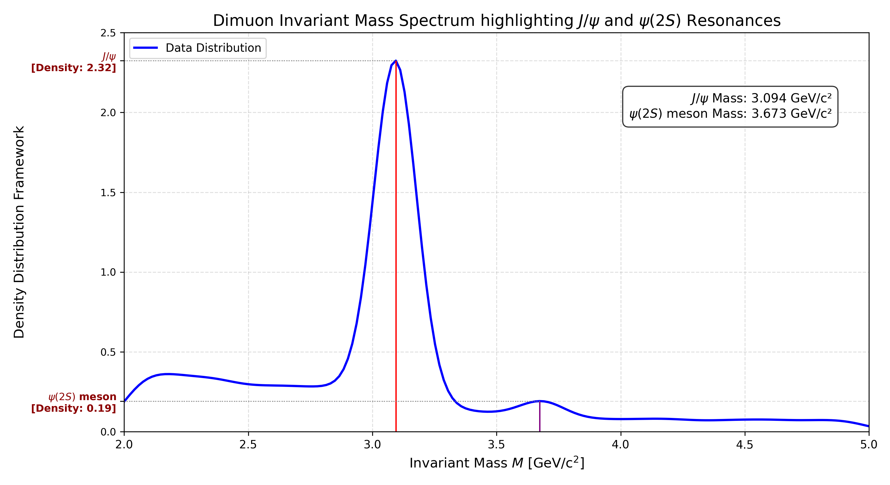

# Reproduction of J/ψ Meson by CERN Open Data (From Run2011A)

## Invariant Mass Spectrum Analysis: Reproducing Ting's J/ψ Discovery
This repository contains Python scripts designed to dynamically analyse dimuon invariant mass distributions using open datasets from CERN. The core goal of this codebase is to reproduce the historic data analysis workflows that led to the discovery of the $J$ particle ($J/\psi$ meson), as documented in Samuel C.C. Ting’s 1976 Nobel Lecture paper: "The discovery of the J particle: A personal recollection".

## Physics Context & Project Scope
In 1974, Samuel Ting's team at Brookhaven National Laboratory (BNL) discovered a massive, narrow resonance in the electron-positron ($e^+e^-$) spectrum at 3.1 GeV using a high-precision double-arm spectrometer. Concurrently, Burton Richter's team at SLAC discovered the same resonance in $e^+e^-$ collisions (naming it $\psi$). This discovery confirmed the existence of the charm quark ($c$), revolutionizing particle physics.
This project reads high-energy collision records dynamically, computes the invariant mass of particle pairs, automatically identifies resonance states without hardcoded assumptions, and renders a continuous distribution line matching modern spectroscopic techniques.

* $J/\psi\$ meson $c\bar{c}$; Rest mass = $3.097 \frac{GeV}{c^2}$
* First Excited State $\psi(2S)$; Rest mass = $3.686 \frac{GeV}{c^2}$
  
## Features

* Vectorized Kinematic Pipeline: Eliminates nested Python loops by implementing NumPy-based multi-column vector operations to compute invariant mass profiles instantly across tens of thousands of data events.
* Sequential Bound-State Peak Detection: Employs structural topology analysis (scipy.signal.find_peaks) to automatically isolate the absolute global maximum ($J/\psi$) and scan sequentially for subsequent higher-energy radial excitations ($\psi(2S)$ meson) along the $X$-axis ($x_{\text{peak2}} > x_{\text{peak1}}$).
* Dual-Resonance Tracking Boundaries: Draws color-coded vertical index lines (Red $\rightarrow J/\psi$; Purple $\rightarrow \psi(2S)$) mapped directly to horizontal tracking grids pointing toward multi-line axis labels.
* Automated Experimental Parameter Box: Generates an isolated statistical overview layout detailing detected resonance positions inside the chart space.

## Plot Result


## Prerequisites
Install the required scientific computing and visualization dependencies:
```bash
pip install pandas numpy matplotlib seaborn scipy
```

Production Script: jpsi_reconstruction.py
Plot Result: jpsi_mass_spectrum.png

## Dataset Reference

* **Source:** CERN Open Data Portal (Record 5203)
* **Collection Run:** CMS Collaboration (Run2011A Primary Dataset)
* **Collector** Thomas McCauley (Data recorded in 2011 and published in 2019)
* **Characteristics** 20,000 recorded opposite-sign dimuon events filtered between $\(2\text{ GeV} < M_{\mu\mu} < 5\text{ GeV}\)$ .
https://opendata.cern.ch/record/5203
